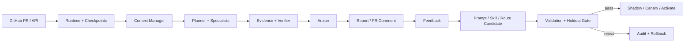

# CodeEvo

> Evaluation-gated, evidence-grounded multi-agent code review platform.

[](https://github.com/Tches-git/CodeEvo/actions/workflows/ci.yml)
[](https://www.python.org/)
[](https://fastapi.tiangolo.com/)
[](LICENSE)

[在线体验](https://vm-0-13-ubuntu.taila0420b.ts.net:8443) ·
[服务状态](https://vm-0-13-ubuntu.taila0420b.ts.net:8443/health/ready) ·
[产品截图](docs/PRODUCT_DEMO.md)

> **v1.1.0 已开放公开工程工作台。** 无需账号或密码；短期访客会话可以运行隔离的本地
> Agent Sandbox，并读取已发布的 Evaluation 与 Evolution 实验制品。Sandbox 使用临时数据库，
> 不调用付费模型、不写回 GitHub，也不能创建生产任务、反馈、修复或修改配置。

CodeEvo 是一个面向真实代码仓库的 AI Agent 工程项目：它不只让多个 Agent “讨论”，而是把
**任务分解、工具调用、上下文压缩、证据绑定、评测门禁、灰度发布和回滚**做成一条可审计链路。
系统支持 GitHub PR Webhook、DeepSeek/OpenAI-compatible 模型、本地确定性规则、Tree-sitter
仓库检索，以及 PostgreSQL + Redis 生产模式。


公开界面包含 Review Workbench、Evaluation Lab、Evolution Lab、任务证据链和管理员标注工作台。
完整交互说明见 [产品界面说明](docs/PRODUCT_DEMO.md)。

## 为什么值得看

| 工程问题 | CodeEvo 的实现 |
|---|---|
| Agent 输出不可复现 | 自研 Runtime、状态机、逐步 checkpoint、任务恢复与执行预算 |
| 长 Diff 成本失控 | 标签无关的风险 Hunk 压缩、输入/输出 Token 上限、JSON 修复边界 |
| 高危结论缺少依据 | Tree-sitter 索引、只读仓库工具、文件哈希与 evidence ID、fail-closed 门禁 |
| “自进化”容易污染线上 | Train/Validation/Holdout 仓库隔离，Prompt/Skill/Route 统一非退化门禁 |
| 多 Agent 不一定更好 | 同数据、同评分逻辑比较本地、单 Agent、多 Agent，并公开质量/延迟/Token 代价 |
| Demo 与生产混淆 | demo fixture、benchmark-derived、public PR 使用独立来源类型与完整性检查 |
| 作品只能看不能操作 | 临时 SQLite Sandbox 真实执行 Harness，带独立权限、大小限制与滑动窗口限流 |

## v1.1 工程工作台

- **Review Workbench**：内置样例、粘贴 Unified Diff 或严格格式的公开 GitHub PR，真实执行
  Security 与 Reliability Agent，返回状态机、协作消息、逐行证据和 Finding。
- **Evaluation Lab**：直接读取已发布 Benchmark 制品，按仓库、CWE、risk/clean 筛选 8 个
  Validation 案例，逐路线比较 TP、FP、FN、延迟、Token 和上下文元数据。
- **Evolution Lab**：展示反馈到候选版本的父子关系、Validation 与封存 Holdout 结果、质量与
  资源非退化 Gate、Shadow 资格和生产来源阻断状态。
- **安全边界**：Guest 只新增 `demo_execute`，原始 `/v1/reviews`、修复、反馈、管理与审计接口
  继续拒绝访问；公开执行结果不进入生产 PostgreSQL。

## 真实 Benchmark 结果

以下结果来自 Vul4J 派生 Validation：8 个案例、4 个互不泄漏的公开仓库，4 risk / 4 clean。
模型为 `deepseek-chat`，目标 CWE 不进入 Prompt。完整实验配置、数据指纹和结果见
[Benchmark 说明](docs/BENCHMARK.md)。

| Route | Precision | Recall | F1 | Clean Accuracy | P95 latency | Tokens |
|---|---:|---:|---:|---:|---:|---:|
| Local rules | 0.00 | 0.00 | 0.00 | 1.00 | 0.3 ms | 0 |
| Single DeepSeek | 0.50 | 0.50 | **0.50** | 0.75 | 8.36 s | 14,671 |
| Multi-agent | **1.00** | 0.25 | 0.40 | **1.00** | 49.13 s | 54,281 |

这组结果没有刻意证明“多 Agent 更强”：单 Agent 的综合 F1 更高，多 Agent 更保守、误报更少，
但消耗更多 Token。这正是评测 Harness 的用途——为路由选择提供证据，而不是用架构复杂度代替效果。

## 30 秒运行

```bash
git clone https://github.com/Tches-git/CodeEvo.git
cd CodeEvo
python3.11 -m venv .venv
source .venv/bin/activate
python -m pip install -e ".[dev]"
python -m codeevo
```

打开 `http://127.0.0.1:8080`。默认是无需外部模型的本地规则模式；复制
`.env.example` 为 `.env` 后可切换 DeepSeek、PostgreSQL、Redis、认证与仓库上下文。

想直接查看带四种标注状态的离线管理台，可运行：

```bash
python scripts/run_local_demo.py
```

生产后端的一键容器启动：

```bash
cp .env.compose.example .env
# 替换 .env 中全部 replace-with-* 值
docker compose up --build -d
curl --fail http://127.0.0.1:8080/health/ready
```

默认只绑定 `127.0.0.1`，同时启动非 root CodeEvo、PostgreSQL 16 和 Redis 7。
完整的部署、升级、备份与故障排查见 [部署指南](docs/DEPLOYMENT.md)。

当前公开 Demo 运行在腾讯云主机上，由独立 Docker Compose 项目提供 PostgreSQL、Redis 和
CodeEvo，并通过 Tailscale Funnel 暴露 HTTPS。服务器部署与验收方式见
[公开 Demo 部署](docs/PUBLIC_DEMO.md)。仓库中的 `render.yaml` 保留为备用托管方案。

```bash
# 单元测试
python -m unittest discover -s tests -v

# 可恢复的三路线 Validation（DeepSeek 路线需要 API Key）
codeevo-benchmark \
  --dataset evaluation_data/vul4j_40.jsonl \
  --output-dir output/benchmark \
  --routes local,single,multi \
  --splits validation --resume
```

> Holdout 默认禁止运行，只有显式传入 `--confirm-holdout` 才会解锁，避免反复看隐藏集调参。

## 核心链路



更多材料：[架构说明](docs/ARCHITECTURE.md) · [Benchmark](docs/BENCHMARK.md) ·
[简历与面试讲解](docs/RESUME_PROJECT.md) · [安全基线](docs/SECURITY.md) ·
[产品界面](docs/PRODUCT_DEMO.md) · [招聘方体验路线](docs/RECRUITER_DEMO.md) ·
[公开 Demo 部署](docs/PUBLIC_DEMO.md) · [路线图](docs/ROADMAP.md)

## 功能清单

- 审查统一 diff，输出结构化问题、修复建议和测试建议
- GitHub `pull_request` webhook（`opened`、`reopened`、`synchronize`）
- OpenAI 兼容模型；未配置模型时自动使用确定性的本地规则审查器
- SQLite 保存任务状态、执行轨迹和最终报告
- FastAPI、Pydantic、OpenAPI 与 Markdown 报告
- webhook HMAC-SHA256 签名校验，以及可选的 GitHub PR 评论回写
- Web 管理台、任务 Dashboard 与 Prometheus 指标
- 安全、可靠性、AI 和动态 Skill Agent 并行协作
- 独立分支上的保守型自动修复提交
- SQLAlchemy 连接池、Alembic 迁移、PostgreSQL 与 Redis 生产模式
- 失败案例回流、提示词评测、版本激活与回滚
- 自研 Agent Runtime、持久化 checkpoint、执行预算与任务断点续跑
- 带 Tool Registry、参数 Schema 校验和结构化 Observation 的有界 Agent Loop
- 覆盖任务、工具、反馈、记忆、观察与 Diff 的统一 Context Window 和逐轮压缩
- Working/Episodic/Semantic 分层记忆、租户级检索、任务归档与过期清理
- Redis Streams ACK、Worker 租约、指数退避重试和死信队列
- Webhook delivery 幂等、重放时间窗与评论 upsert
- 用户登录、RBAC、租户/仓库隔离和不可变管理审计
- 动态 Skill manifest 校验、签名校验和隔离进程沙箱
- 自动修复后的编译/测试门禁、灰度发布与影子流量
- OpenTelemetry Trace、Prometheus 指标和持久化告警
- 结构化 JSON 请求日志与显式可信代理边界
- Tree-sitter 仓库索引、文件读取、符号/引用/调用方检索和证据哈希绑定
- 真实公开 PR 标注工作台、双人盲审、冲突仲裁与仓库级数据隔离
- 通过来源和完整性门禁的 JSONL 可直接接入 Evaluation Harness
- 可恢复 Benchmark Runner 公平对比本地规则、单 DeepSeek 与多 Agent 路线
- 公开临时 Sandbox、真实逐行 Evidence、Evaluation Lab 与 Evolution Lab

## 快速开始

项目使用 Python 3.11。先安装锁定范围内的运行依赖，并在同一个 PowerShell 窗口中配置本地管理员：

```powershell
python -m pip install -r requirements.txt

$bytes = New-Object byte[] 32
[Security.Cryptography.RandomNumberGenerator]::Create().GetBytes($bytes)
$env:CODEEVO_AUTH_REQUIRED = 'true'
$env:CODEEVO_AUTH_SECRET = [Convert]::ToBase64String($bytes)
$env:CODEEVO_BOOTSTRAP_ADMIN_USERNAME = 'admin'
$env:CODEEVO_BOOTSTRAP_ADMIN_PASSWORD = '<替换为至少 10 个字符的密码>'

python -m codeevo
```

不要直接使用示例占位符作为密码或密钥。环境变量只对当前 PowerShell 及其子进程生效；修改配置后需要停止并重新启动 CodeEvo。

Bootstrap 管理员只在用户名尚不存在时创建；已有同名用户的密码不会在重启时被覆盖。

服务默认监听 `127.0.0.1:8080`。启动后打开 `http://127.0.0.1:8080/`，前端会在业务 API 返回未授权状态后显示登录层。登录状态保存在当前浏览器的 `localStorage` 中；需要重新登录时可以点击退出，或清除站点数据。

交互式 OpenAPI 文档位于 `http://127.0.0.1:8080/docs`，备用 ReDoc 位于 `/redoc`。所有 API 响应都会携带 `X-Request-ID`，调用方也可以传入符合格式的请求 ID 进行链路关联。

API 调用需要先登录并携带 Bearer Token：

```powershell
$session = Invoke-RestMethod -Method Post -Uri http://127.0.0.1:8080/v1/auth/login `
  -ContentType 'application/json' `
  -Body (@{username='admin'; password='<你的密码>'} | ConvertTo-Json)
$headers = @{Authorization="Bearer $($session.access_token)"}
Invoke-RestMethod -Method Post -Uri http://127.0.0.1:8080/v1/reviews `
  -Headers $headers `
  -ContentType 'application/json' `
  -Body (@{
    repository = 'demo/api'
    pull_request = 12
    diff = "diff --git a/app.py b/app.py`n--- a/app.py`n+++ b/app.py`n@@ -1 +1,2 @@`n+password = 'secret'`n+eval(user_input)"
  } | ConvertTo-Json)
```

查询任务：

```powershell
Invoke-RestMethod -Headers $headers http://127.0.0.1:8080/v1/tasks/<task-id>
Invoke-WebRequest -Headers $headers http://127.0.0.1:8080/v1/tasks/<task-id>/report
```

运行测试：

```powershell
python -m unittest discover -s tests -v
```

## 模型配置

默认 `CODEEVO_LLM_PROVIDER=local`，此时只运行确定性的本地规则 Agent，不会调用大模型。

DeepSeek 官方 API（按 Token 计费）：

```powershell
$env:CODEEVO_LLM_PROVIDER = 'deepseek'
$env:CODEEVO_DEEPSEEK_API_KEY = '<deepseek-api-key>'
python -m codeevo
```

通过 OpenRouter 使用有速率限制、可用性可能变化的 DeepSeek 免费模型：

```powershell
$env:CODEEVO_LLM_PROVIDER = 'openrouter-deepseek-free'
$env:CODEEVO_OPENROUTER_API_KEY = '<openrouter-api-key>'
python -m codeevo
```

如果指定的免费 DeepSeek 版本下线，可将 `CODEEVO_LLM_MODEL` 改为 OpenRouter 当前提供的其他 `:free` 模型，或把 Provider 改为 `openrouter-free` 让免费路由自动选择可用模型。

任意其他 OpenAI Chat Completions 兼容端点使用 `custom`：

```powershell
$env:CODEEVO_LLM_PROVIDER = 'custom'
$env:CODEEVO_LLM_BASE_URL = 'https://example.com/v1'
$env:CODEEVO_LLM_API_KEY = '<token>'
$env:CODEEVO_LLM_MODEL = '<model-name>'
```

密钥只通过环境变量读取，不要提交到仓库。

项目启动时会自动读取项目根目录的 `.env`，也兼容 `codeevo/.env`；系统环境变量优先于 `.env` 文件。推荐将以下内容写入根目录 `.env`（该文件已被 `.gitignore` 忽略）：

```env
CODEEVO_LLM_PROVIDER=deepseek
CODEEVO_DEEPSEEK_API_KEY=你的真实APIKey
```

## 评测与提示词进化

服务启动时会建立基础验证集和隐藏回归集。候选提示词不会接受调用方提供的“回归分数”作为上线依据，而是：

1. 使用当前提示词和候选提示词分别回放同一批验证 Diff；
2. 计算精确率、召回率、F1、严重级别正确率、高风险召回率、干净样本正确率和执行成功率，同时记录单案例延迟、P50/P95/P99、模型调用、Token 和成本；调用失败会按漏报或失败的干净样本计分；
3. 候选必须在验证集达到最小提升，并通过隐藏集质量以及 P95 延迟、Token、成本非退化门禁；Prompt、声明式 Skill 和路由策略共用同一门禁实现；
4. 没有配置大模型，或验证集、隐藏集样本不足时只保存候选，状态为 `deferred`；
5. 评测记录包含提示词和数据集 SHA-256 指纹，隐藏集只持久化聚合指标，不暴露案例明细；
6. 没有新增有效反馈信号时不会重复创建内容相同的候选版本；
7. 所有评测运行、版本、指标和激活决定均持久化，可回滚；供应商没有返回 usage 或没有配置单价时，报告明确标记 `unavailable`，不填造 Token 或成本。

### 真实公开 PR 数据集

真实数据导入器要求人工标注清单使用 schema v1，并为每条记录提供公开仓库、PR 编号、标注人、ISO-8601 标注时间、方法、证据链接和 License 证明。导入时会从 GitHub 绑定 base/head SHA 与 Diff SHA-256，再按 repository 做确定性 Train/Validation/Holdout 分区；同仓库跨分区、重复 Diff、私有仓库、哈希不一致或缺少来源证明都会 fail closed。

```bash
python scripts/import_github_pr_dataset.py \
  evaluation_data/public_pr_manifest.example.jsonl \
  evaluation_data/public_pr_100.jsonl \
  --limit 100 --dataset-version 1.0.0
```

命令同时生成 `public_pr_100.jsonl.manifest.json`，其中包含数据集 SHA-256、分区统计与完整性报告。示例清单仅演示字段格式，其中占位仓库不能直接作为真实基准。

### 无人工标注的 Vul4J 可执行基准

如果项目由单人维护，可跳过人工标注主流程，直接从 Vul4J 官方数据和公开安全修复提交生成可审计的评测对：

```bash
codeevo-import-vul4j \
  evaluation_data/vul4j_40.jsonl \
  --limit 20 --dataset-version 1.0.0
```

每个 Vul4J 记录生成两个同分区案例：

- `risk`：反向应用官方安全补丁，得到“引入已知漏洞”的 Diff；CWE 来自 Vul4J，严重级别来自 NVD CVSS，候选区域由原补丁删除的生产 Java 代码界定；
- `clean`：保持官方安全修复的正向 Diff，目标漏洞的期望 findings 为空；
- 两者均记录 Vul4J 记录哈希、GitHub commit/parent SHA、正向和派生 Diff SHA-256、许可证、NVD 证据、复现命令和确定性 repository split。

下载响应默认缓存到 `OUTPUT.cache/`。若 GitHub 匿名 API 达到限额，可设置 `GITHUB_TOKEN` 后重跑；已校验的响应不会重复下载。NVD 高频导入可选设置 `NVD_API_KEY`。

这类数据的来源标记是 `benchmark-derived`，`reviewer_count` 为 `0`，不会冒充人工标注。评测范围是 `target-cwe-case-level`：只判断 Agent 是否在风险版本识别出目标 CWE、在修复版本不再报告目标 CWE；其他 CWE 不参与该案例计分。这里的 clean 只表示目标漏洞已被基准补丁修复，不保证该提交不存在无关问题，也不声称自动定位到唯一根因行。默认采用 Vul4J 发布的可复现状态；如果你已在本机运行对应的 `vul4j reproduce -i ...` 命令，可增加 `--locally-reproduced`。发布门禁接受来源校验通过的 `public-github-pr` 或 `benchmark-derived` 数据，仍拒绝 synthetic/demo/来源不完整的数据。

Vul4J 数据为 CC BY 4.0，CodeEvo 项目代码为 Apache-2.0；CodeEvo 只读取数据和公开补丁，不复制其工具代码。外部仓库源文件仍保留各自许可证，发布派生数据前需保留数据集、CVE 和仓库归属信息。详见 [第三方数据声明](THIRD_PARTY_NOTICES.md)。

受控本地基准和路由候选门禁均可独立复现：

```bash
python scripts/run_e2e_evaluation.py
python scripts/run_routing_policy_evaluation.py
```

### 三路线 Benchmark Runner

`codeevo-benchmark` 在同一批有序案例、同一 Split、同一 CWE 匹配规则下对比三种审查路线，并逐案例原子保存 checkpoint：

- `local-rules`：确定性本地规则 Agent，不调用模型；
- `single-deepseek`：单 DeepSeek 审查 Agent；
- `multi-agent`：安全规则、可靠性规则和 DeepSeek 专家，经规划、质疑、证据验证与仲裁后输出结果。

默认只运行 Validation，避免反复查看 Holdout 后调参：

```bash
codeevo-benchmark \
  --dataset evaluation_data/vul4j_40.jsonl \
  --output-dir output/benchmark-0.8 \
  --routes local,single,multi \
  --splits validation \
  --resume
```

LLM 路线默认使用标签无关的风险 Hunk 压缩：总上下文预算 `1200` Token，其中
`256` Token 留给指令与 Agent 循环状态；每次模型调用最多输出 `1200` Token，
每个响应最多接受 `4` 个 Finding。截断或非法 JSON 最多触发一次紧凑格式修复请求。官方
DeepSeek 默认使用稳定的 `deepseek-chat` 别名；实验性推理模型应先单案例冒烟再用于整组评测。可通过
`--context-max-tokens`、`--context-reserved-tokens`、`--max-output-tokens`
、`--max-findings` 和 `--max-json-repair-attempts` 调整。所有预算和压缩策略都会写入公开路线配置及 checkpoint
指纹，因此改动预算后不会复用旧结果。

确需进行最终 Holdout 评估时，必须显式确认：

```bash
codeevo-benchmark \
  --dataset evaluation_data/vul4j_40.jsonl \
  --output-dir output/benchmark-0.8-holdout \
  --routes local,single,multi \
  --splits holdout \
  --confirm-holdout
```

输出目录包含 `benchmark-report.json`、`benchmark-report.md`、独立静态 `benchmark-report.html` 和按路线/案例组织的 `checkpoints/`。报告统计 Precision、Recall、F1、Clean Accuracy、High-risk Recall、Severity Accuracy、成功率、P50/P95/P99 延迟、Token、模型调用和成本可用状态，并提供 Split、CWE、Severity、Repository 维度。每个案例还记录压缩状态、压缩前后 Token 估算、省略文件/Hunk 数、策略和原始 Diff SHA-256；不保存完整模型 Prompt。Prompt、模型、预算或协作参数改变会使旧 checkpoint 自动失效；`--retry-failures` 可在恢复时只重试失败案例。

当前仓库中的 `evaluation_data/pr_diff_100.jsonl` 是受控合成回归数据，只适合功能演示与自动化测试，不能作为真实生产效果证明。正式简历结果应使用来源校验通过的 `vul4j_40.jsonl` 或公开 PR 数据集。

### 双人标注工作台

管理台的“标注工作台”用于生产真实公开 PR 真值，不需要先手写 JSONL：

1. 管理员输入公开仓库、PR 编号、License SPDX 和许可证证据 URL；
2. 服务端从 GitHub 读取 PR 元数据与 Diff，绑定 base/head SHA、Diff SHA-256，并按 repository 确定 Train、Validation 或 Holdout；
3. 两个不同的 `maintainer` 或 `admin` 账号独立提交 `risk` 或 `clean`。第二位提交前看不到第一份答案；
4. 文件、行范围、CWE、严重级别和 verdict 一致时自动通过，不一致时进入第三人仲裁；
5. 仲裁者不能是原始标注人。所有导入、提交、仲裁和导出操作进入租户审计日志；
6. 导出只接收 `approved` 案例，并重新运行 Harness case 校验、公开来源校验、仓库泄漏检测和重复 Diff 检测。

普通读取接口不会返回 Holdout 真值。管理员在双人标注完成前也看不到另一位评审的具体答案，以减少锚定偏差。导出的 `application/x-ndjson` 文件可直接传给 `codeevo.evaluation_harness.load_jsonl` 或现有评测脚本。

无需 GitHub 网络即可准备界面演示数据：

```bash
codeevo-seed-annotation-demo codeevo-demo.db
CODEEVO_DB_PATH=codeevo-demo.db python -m codeevo
```

演示数据明确使用 `demo-fixture` 来源，因此会被真实数据导出门禁拒绝，不能伪装成公开 PR 数据集。若要演示两个独立登录账号，可额外传入 `--reviewer-password`，该密码只应在本地临时环境使用。

`POST /v1/deployments/llm-review` 在 `shadow_percent` 或 `canary_percent` 大于 0 时要求请求携带 `offline_evaluation.baseline` 与 `offline_evaluation.candidate`；服务端会重新计算统一门禁，不信任调用方自报的通过状态。未通过的候选不能进入 Shadow/Canary。

可通过 `POST /v1/evaluation/cases` 增加版本化样本，`split` 支持 `train`、`validation` 和 `holdout`。样本名称和内容绑定且不可覆盖；修订样本必须使用新名称，重复提交相同内容则保持幂等。期望结果可选填 `rule_id`，用于避免“同一行但错误类别”的结果被算作命中。`POST /v1/evolution/auto` 会从未解决反馈生成候选并执行同样的真实回放门禁。

仓库还提供可复现的受控离线进化证明：它只从 Validation 仓库的确认漏报中提取经过格式校验的 `rule_id`，自动生成 Prompt v2，然后在仓库完全隔离的 Holdout 上回放并保存真实版本链、`evolution_runs`、数据指纹和报告：

```powershell
python scripts/run_prompt_evolution_proof.py
```

输出位于 `output/prompt-evolution-proof/`。该实验用于证明“反馈驱动的提示词版本确实改变 Agent 行为并通过隐藏集门禁”，数据来源仍是 `synthetic-controlled`，因此生产来源门禁保持失败；它不应被表述为外部 LLM 权重提升或真实公开 PR 上的生产效果。

## Skill 自进化

Skill 自进化与提示词进化是两套独立版本链。系统不会把反馈直接拼成 Python 执行，而是生成无主机权限的声明式 Skill artifact。artifact 可以新增确认漏报规则或移除确认误报规则，并包含父版本、内容 SHA-256、评测分数和激活状态。

`POST /v1/skill-evolution/auto` 从当前租户未解决反馈生成候选。漏报反馈应携带 `finding.rule_id`、`severity`、`path` 和 `line`；系统优先使用 `finding.evidence`，缺失时从原任务 Diff 的对应新增行提取字面匹配证据。候选只有在 Validation 获得最小提升、受保护指标不退化且 Holdout 非退化时才会自动激活并解析所使用的反馈。被拒绝或样本不足的版本仍会保存供审计，但不会进入审查链路。

也可以向 `POST /v1/skill-evolution/propose` 提交人工构造的候选：

```json
{
  "skill_name": "evolved-review",
  "artifact": {
    "name": "evolved-review",
    "description": "Confirmed project-specific review rules",
    "rules": [{
      "rule_id": "SEC-DANGEROUS-CALL",
      "severity": "high",
      "match": "dangerous_call(data)",
      "title": "Dangerous call",
      "explanation": "A confirmed unsafe API was added.",
      "fix": "Use the constrained API.",
      "test": "Add a regression test."
    }]
  }
}
```

激活后服务会把 `evolved-review@<version>` 作为真实 specialist 加入当前租户的 `MultiAgentCoordinator`。artifact、激活版本、进化运行和运行时注入均按租户隔离；重启、`/v1/skills/reload` 和版本回滚都会从数据库恢复相应 artifact。Skill 名称必须以 `evolved-` 开头，规则只支持新增行上的受限字面匹配，不支持任意代码、正则表达式或主机权限。

相关门禁可通过以下环境变量调整：

- `CODEEVO_EVAL_MIN_CASES`：验证集最少样本数；
- `CODEEVO_EVAL_MIN_HOLDOUT_CASES`：隐藏集最少样本数；
- `CODEEVO_EVAL_MAX_CASES`：每个数据分区单次最多回放样本数；
- `CODEEVO_EVAL_MIN_IMPROVEMENT`：验证集最小分数提升；
- `CODEEVO_EVAL_MAX_METRIC_REGRESSION`：受保护指标允许的最大退化，默认 `0`。
- `CODEEVO_EVAL_MAX_LATENCY_GROWTH_RATIO`：P95 延迟允许的最大增长比例，默认 `0.25`；
- `CODEEVO_EVAL_MAX_TOKEN_GROWTH_RATIO`：总 Token 允许的最大增长比例，默认 `0.20`；
- `CODEEVO_EVAL_MAX_COST_GROWTH_RATIO`：估算成本允许的最大增长比例，默认 `0.20`；
- `CODEEVO_LLM_INPUT_COST_PER_MILLION` / `CODEEVO_LLM_OUTPUT_COST_PER_MILLION`：供应商不返回费用时使用的美元/百万 Token 价格快照。

## GitHub Webhook

项目使用“GitHub 仓库 Webhook + 公网转发 + fine-grained PAT”接收 PR 事件，不需要创建或安装 GitHub App：

```text
GitHub Pull request 事件
        │
        ▼
https://<公网域名>/webhooks/github
        │  公网转发
        ▼
http://127.0.0.1:8080/webhooks/github
        │
        ▼
CodeEvo 创建异步审查任务
```

### 1. 配置 CodeEvo

先生成一个 Webhook Secret，并根据需要配置 GitHub fine-grained personal access token：

```powershell
$webhookBytes = New-Object byte[] 32
[Security.Cryptography.RandomNumberGenerator]::Create().GetBytes($webhookBytes)
$env:CODEEVO_GITHUB_WEBHOOK_SECRET = [Convert]::ToBase64String($webhookBytes)

# 私有仓库、PR 评论回写或自动修复需要；只审查公开仓库且不回写时可以不配置。
$env:CODEEVO_GITHUB_TOKEN = '<GitHub fine-grained PAT>'

# 默认关闭。设为 true 后，审查完成时更新或创建 PR 评论。
$env:CODEEVO_AUTO_POST_REVIEW = 'true'

python -m codeevo
```

Webhook Secret 用于验证 GitHub 请求头中的 HMAC-SHA256 签名，不能与登录用的 `CODEEVO_AUTH_SECRET` 混用。Webhook 请求不携带管理台 Bearer Token；`/webhooks/github` 使用签名而不是用户登录进行认证。

fine-grained PAT 只授权需要接入的仓库，并按功能授予最小权限：

- 读取私有仓库 PR Diff：`Contents: Read`、`Pull requests: Read`；
- 回写审查评论：`Pull requests: Read and write`；
- 创建自动修复分支和提交：`Contents: Read and write`、`Pull requests: Read and write`。

只接收 Webhook 但不访问私有仓库、不回写评论且不执行自动修复时，可以不设置 PAT。密钥必须在启动 CodeEvo 前设置，修改后需要重启服务。

### 2. 建立公网转发

GitHub 无法访问 `127.0.0.1`，需要把公网 HTTPS 地址转发到本地 `http://127.0.0.1:8080`。任选一种已安装的转发工具，例如：

```powershell
# Cloudflare Quick Tunnel
cloudflared tunnel --url http://127.0.0.1:8080

# 或 ngrok
ngrok http 8080
```

命令启动后会显示一个形如 `https://example.trycloudflare.com` 或 `https://example.ngrok-free.app` 的公网 HTTPS 地址。保持 CodeEvo 和转发进程同时运行。临时公网地址通常会在转发工具重启后变化，变化后必须同步更新 GitHub Webhook 的 Payload URL。

上述快捷转发会把 8080 端口上的管理台和 API 一并暴露到公网，因此必须保持 `CODEEVO_AUTH_REQUIRED=true`，并使用强管理员密码和随机 `CODEEVO_AUTH_SECRET`。长期部署建议通过反向代理只公开 `/webhooks/github`（以及按需公开 `/health`），不要向公网暴露整个管理台。

### 3. 在 GitHub 仓库中添加 Webhook

进入目标仓库的 **Settings → Webhooks → Add webhook**，填写：

- **Payload URL**：`https://<公网域名>/webhooks/github`；
- **Content type**：`application/json`；
- **Secret**：与 `CODEEVO_GITHUB_WEBHOOK_SECRET` 完全相同；
- **SSL verification**：保持启用；
- **Which events would you like to trigger this webhook?**：选择 **Let me select individual events**，只勾选 **Pull requests**；
- **Active**：保持勾选。

CodeEvo 会处理 `opened`、`reopened` 和 `synchronize` 三种 PR 动作；其他 `pull_request` 动作会正常接收但被忽略。服务会根据 payload 中的 `diff_url` 下载 Diff，并异步创建审查任务。

### 4. 验证连接

先确认本地服务和公网地址都能访问健康检查：

```powershell
Invoke-RestMethod http://127.0.0.1:8080/health
Invoke-RestMethod https://<公网域名>/health
```

然后新建 PR、重新打开 PR，或向 PR 推送一次提交。在 GitHub 的 **Settings → Webhooks → Recent Deliveries** 中应看到 `/webhooks/github` 返回 `202`；管理台的任务中心随后会出现对应审查任务。如果失败，优先检查公网转发进程是否仍在运行、Payload URL 是否包含 `/webhooks/github`、Secret 是否一致，以及 PAT 是否有目标仓库权限。

默认只在管理台保存结果。只有 `CODEEVO_AUTO_POST_REVIEW=true` 时才会向 PR 回写评论。

自动修复只覆盖可确定安全的规则，例如调试输出、`shell=True` 和硬编码 Python 凭据；结果始终提交到新的 `codeevo/fix-pr-*` 分支，不直接修改源分支。

## 完整生产模式

```powershell
Copy-Item .env.compose.example .env
# 替换 .env 中全部 replace-with-* 值
docker compose up --build -d
docker compose ps
```

Compose 会启动 PostgreSQL、Redis 和 CodeEvo，并等待数据库和队列健康后再启动 API。CodeEvo 容器以非 root 用户、只读根文件系统和零 Linux capabilities 运行。Compose 不提供默认管理员密码、数据库密码或签名密钥；缺少这些配置时会拒绝启动。未配置 PostgreSQL 和 Redis 时，项目自动退回 SQLite 与进程内线程队列，适合本地演示。

三个探针承担不同职责：`/health/live` 只检查 API 进程，`/health/ready` 实际查询数据库和队列并在故障时返回 `503`，`/health` 保留运行组件摘要。容器编排应使用 readiness，不要用摘要接口判断是否接收流量。完整运维流程见 [部署指南](docs/DEPLOYMENT.md)。

PostgreSQL 模式通过 SQLAlchemy 管理连接池，并在启动时执行随包发布的 Alembic 迁移。希望由发布流水线独立控制迁移时，先运行：

```powershell
$env:CODEEVO_DATABASE_URL = 'postgresql://codeevo:<password>@localhost:5432/codeevo'
codeevo-migrate head
$env:CODEEVO_DATABASE_AUTO_MIGRATE = 'false'
python -m codeevo
```

生产反向代理必须把实际代理网段写入 `CODEEVO_TRUSTED_PROXY_CIDRS`，例如 `10.0.0.0/8,192.168.10.0/24`。未配置或来源不在这些网段时，服务会忽略 `X-Forwarded-For` 和 `X-Forwarded-Proto`，防止伪造客户端地址绕过登录限流。默认日志格式为单行 JSON，不记录请求体、密码、Diff 或 Prompt；可用 `CODEEVO_LOG_FORMAT=text` 切换本地文本日志。

## 仓库上下文 Agent

只提交 Diff 时，CodeEvo 保留原有的确定性审查模式。配置只读仓库根目录后，Agent 会同时获得仓库级上下文工具：

- `read_repository_file`：按行读取文件并返回内容 SHA-256 和 evidence ID；
- `search_repository`：在受限文件集合中执行字面检索；
- `find_symbol`：使用 Tree-sitter 定位函数、方法、类型和类定义；
- `find_references`：按语法树标识符定位引用；
- `find_callers`：按调用表达式定位调用方；
- `list_repository_files`、`repository_index_status`：查看可读文件与索引状态。

仓库目录必须按 `<根目录>/<owner>/<repository>` 组织，并且必须是与待审查 Diff 对应的 PR head checkout。例如：

```text
/srv/codeevo-repositories/
└── acme/
    └── payments-api/
        ├── src/
        └── tests/
```

```powershell
$env:CODEEVO_REPOSITORY_ROOT = '/srv/codeevo-repositories'
python -m codeevo
Invoke-RestMethod 'http://127.0.0.1:8080/v1/repository-context/status?repository=acme/payments-api&build_index=true'
```

容器部署需要把宿主机仓库根目录只读挂载到容器，例如 `-v /srv/codeevo-repositories:/repositories:ro`，并在容器内设置 `CODEEVO_REPOSITORY_ROOT=/repositories`。不要挂载开发者主目录或文件系统根目录。

启用仓库上下文后，Critical/High Finding 必须同时满足：位置属于新增行、Diff 证据可复现、对应仓库文件已经读取、文件行内容与 Finding 引用一致。报告会保存路径、行范围、文件 SHA-256 和 evidence ID；快照缺失或内容不匹配时采用 fail-closed 策略拒绝高风险结论，并在协作摘要中标记证据门禁拒绝数量。

工作区拒绝绝对路径、`..`、符号链接、二进制文件、超限文件、`.env`、私钥和凭据文件；Tree-sitter 索引还受文件数与总字节预算限制。相关上限位于 `.env.example`。

无需外部模型即可运行可复现演示，生成带 Tree-sitter 符号、调用方和 evidence ID 的 JSON/Markdown 报告：

```powershell
python scripts/run_repository_context_demo.py
```

## API

| 方法 | 路径 | 说明 |
|---|---|---|
| `GET` | `/health/live` | 进程存活探针 |
| `GET` | `/health/ready` | PostgreSQL/SQLite 与 Redis/内存队列就绪探针 |
| `GET` | `/health` | 运行组件摘要 |
| `POST` | `/v1/auth/login` | 登录并获取租户绑定的短期 Bearer Token |
| `POST` | `/v1/reviews` | 创建同步审查任务 |
| `POST` | `/v1/reviews?async=true` | 创建异步审查任务 |
| `GET` | `/v1/tasks/{id}` | 获取状态、轨迹和报告 |
| `GET` | `/v1/tasks/{id}/report` | 获取 Markdown 报告 |
| `GET` | `/v1/tasks/{id}/feedback` | 获取该已完成任务的反馈历史 |
| `POST` | `/v1/tasks/{id}/fix` | 创建自动修复分支和提交 |
| `POST` | `/v1/tasks/{id}/feedback` | 回流误报、漏报或坏修复 |
| `POST` | `/v1/tasks/{id}/cancel` | 请求取消任务 |
| `POST` | `/v1/tasks/{id}/resume` | 从最近 checkpoint 续跑任务 |
| `POST` | `/webhooks/github` | 接收 GitHub PR webhook |
| `POST` | `/v1/skills/reload` | 动态重新加载 Skill |
| `POST` | `/v1/evolution/auto` | 从失败案例生成并评测提示词版本 |
| `POST` | `/v1/evolution/propose` | 评测指定提示词候选版本 |
| `GET/POST` | `/v1/evaluation/cases` | 查询或增加版本化评测样本 |
| `POST` | `/v1/evaluation/routing-policy` | 对路由候选执行质量/延迟/Token/成本离线门禁 |
| `GET` | `/v1/annotations/cases` | 按状态和分区查询标注队列，不返回他人未完成盲审答案 |
| `POST` | `/v1/annotations/cases/import` | 验证并导入真实公开 GitHub PR |
| `GET` | `/v1/annotations/cases/{id}` | 获取来源证明、Diff 和权限范围内的标注详情 |
| `POST` | `/v1/annotations/cases/{id}/submissions` | 提交一次独立风险或干净标注 |
| `POST` | `/v1/annotations/cases/{id}/adjudications` | 由非原标注者提交冲突仲裁 |
| `GET/POST` | `/v1/annotations/exports` | 查询或创建 Harness 数据集导出 |
| `GET` | `/v1/annotations/exports/{id}/download` | 下载带数据集 SHA-256 响应头的 JSONL |
| `GET` | `/v1/evolution/status` | 查询模型与评测门禁就绪状态 |
| `GET` | `/v1/evolution/runs` | 查询持久化的新旧版本评测记录 |
| `POST` | `/v1/skills/{name}/versions/{version}/activate` | 激活或回滚版本 |
| `POST` | `/v1/skill-evolution/auto` | 从确认反馈生成、回放并门禁 Skill 候选 |
| `POST` | `/v1/skill-evolution/propose` | 评测指定声明式 Skill artifact |
| `GET` | `/v1/skill-evolution/status?skill_name={name}` | 查询 Skill 门禁与激活版本 |
| `GET` | `/v1/skill-evolution/runs` | 查询 Skill 进化运行与指标 |
| `GET` | `/v1/skill-evolution/{name}/versions` | 查询 Skill artifact 版本链 |
| `POST` | `/v1/skill-evolution/{name}/versions/{version}/activate` | 激活或回滚 Skill artifact |
| `GET` | `/metrics` | Prometheus 文本指标 |
| `GET` | `/api/alerts` | 查询租户告警 |
| `GET` | `/api/audit` | 查询租户审计日志 |
| `GET` | `/api/queue/dead-letters` | 查询死信任务 |
| `POST` | `/v1/queue/dead-letters/replay` | 重放死信任务 |
| `GET/POST` | `/api/deployments/llm-review`、`/v1/deployments/llm-review` | 查询或配置灰度/影子发布 |

`POST /v1/reviews` 的 `diff` 最大默认 1 MiB；单任务默认最多 8 步、120 秒。可通过环境变量调整，详见 `.env.example`。

完成审查后，可在任务详情的“审查反馈”区域提交 `false_positive`、`missed_issue` 或 `bad_fix`。接口要求任务已成功完成，并会将反馈按任务、租户保存；`missed_issue` 建议附带 `finding.rule_id`、`path` 和 `line`，以便后续候选学习准确的检查目标。

## 架构

```text
HTTP / GitHub Webhook
        │
        ▼
 ReviewService ── TaskRepository
        │            ├── TaskStore / SQLite（本地）
        │            └── SQLAlchemy Pool + psycopg / PostgreSQL（生产）
        │
        ▼
 ReviewHarness (CodeEvo Runtime / checkpoint / resume / budget / trace)
        │
        ├── DiffParser
        ├── Redis Streams / ACK / lease / retry / DLQ
        ├── ContextManager (unified token budget / iterative context compression)
        ├── RepositoryWorkspace (read-only path boundary / evidence ledger)
        ├── Tree-sitter Index (symbols / references / callers)
        ├── MemoryManager (working / episodic / semantic / consolidation / expiry)
        └── MultiAgentCoordinator
              ├── Planner：按语言、文件和风险域分解任务
              ├── Specialists（并行）
              │     ├── 独立 Security Rule Agent
              │     ├── 独立 Reliability Rule Agent
              │     ├── OpenAI-compatible LLM Agent
              │     └── dynamically loaded Skills
              ├── Agent Loop：Plan / Tool / Observe / Final，带工具 Schema、步骤与时间预算
              ├── Critic → Reflection：质疑并把修订请求交回原 Agent
              ├── Evidence Agent：独立复核新增行证据
              ├── Verifier：执行置信度、证据和修复安全门禁
              └── Arbiter：合并冲突并裁决最终 findings

Public GitHub PR
        │
        ▼
 AnnotationService
        ├── Public provenance / Diff SHA-256
        ├── Repository-level split
        ├── Reviewer A ─┐
        ├── Reviewer B ─┴── Agreement / Adjudication
        └── DatasetManifest ── Evaluation Harness JSONL
```

Harness 由项目内 `AgentRuntime` 控制状态流转：`PENDING → PLANNING → EXECUTING → REVIEWING → SUCCESS`。LLM Specialist 在有界 Agent Loop 中依据 Tool Registry 暴露的参数 Schema 选择 Diff 搜索、变更行读取、文件列表和记忆检索工具；Runtime 在调用前校验参数，并把结果或错误写成结构化 Observation。ContextManager 每轮重新组合任务、工具 Schema、Critic 反馈、历史记忆、最新 Observation 与风险排序后的 Diff，共享统一 Token 预算。MemoryManager 按租户与仓库检索历史经验，任务结束后把裁决摘要归档为 Episodic Memory、释放 Working Memory，并在 Recall 前清理过期记录。步骤和时间预算耗尽后，Agent 进入既有重试/交接流程。协作协议仍为 `规划 → 初审 → 质疑 → 反思/补证 → 验证 → 裁决`，消息、工具观察、重试、任务交接和最终裁决均随任务持久化。

HTTP 层由 FastAPI/Uvicorn 提供，Pydantic 对输入执行强类型与额外字段校验；统一中间件负责请求体上限、请求 ID、CSP 等安全响应头。认证接口按客户端地址与用户名组合实施滑动窗口限流，不信任未经配置的转发请求头。

## 基础设施集成测试

普通测试不要求 Docker；CI 的 `integration` 作业会启动 PostgreSQL 16 与 Redis 7，验证 Alembic 迁移、Repository 读写、Redis Streams 投递和签名 Webhook。也可以连接一次性测试实例在本地运行：

```powershell
$env:CODEEVO_INTEGRATION_DATABASE_URL = 'postgresql://codeevo:<password>@127.0.0.1:5432/codeevo'
$env:CODEEVO_INTEGRATION_REDIS_URL = 'redis://127.0.0.1:6379/15'
python -m unittest discover -s tests/integration -v
```
