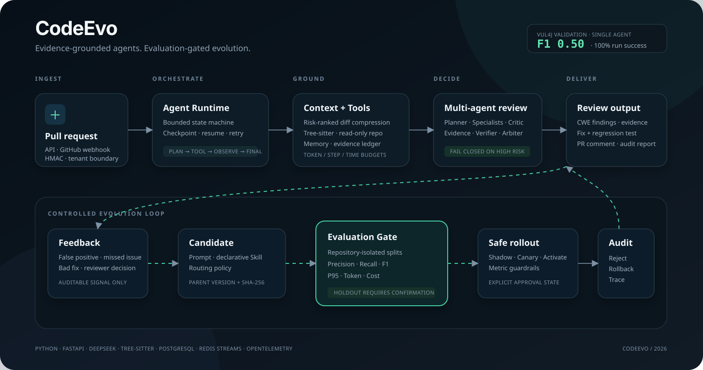

# CodeEvo Architecture

CodeEvo 的核心设计目标不是增加 Agent 数量，而是让 Agent 运行具备可控、可证、可评测、可回滚的工程边界。

## 1. 请求与任务层

- FastAPI 接收同步 API 与 GitHub `pull_request` Webhook。
- HMAC、请求大小、认证、租户和仓库权限在进入任务队列前校验。
- SQLite + 进程内队列用于本地演示；PostgreSQL + Redis Streams 用于生产运行。
- Webhook delivery、任务租约、ACK、重试和 DLQ 都具有明确的幂等键。

## 2. Agent Runtime

任务通过 `PENDING → PLANNING → EXECUTING → REVIEWING → SUCCESS` 状态机执行。每个节点可以写入
checkpoint，失败后从最近安全状态恢复。Agent Loop 只允许 `Plan / Tool / Observe / Final` 四类动作，
并同时受步骤数、总时限、工具参数 Schema 和上下文 Token 预算限制。

## 3. 上下文与证据

`ContextManager` 对 Diff Hunk 风险排序，在固定预算中组合任务、记忆、Critic 反馈、工具描述与 Observation。
线上仓库上下文使用只读 Workspace 和 Tree-sitter 索引提供符号、引用、调用方和文件范围读取。Critical/High
Finding 缺少已读文件哈希和匹配 evidence ID 时 fail closed。

## 4. 协作协议

`MultiAgentCoordinator` 执行：

1. Planner 按文件、语言和风险域生成 assignment；
2. Security、Reliability、LLM 和动态 Skill Specialist 独立检查；
3. Critic 提出反例与缺失证据；
4. 原 Specialist 反思和修订；
5. Evidence Agent 与 Verifier 执行位置、证据、置信度和修复安全门禁；
6. Arbiter 规范化 CWE、解决冲突并输出最终 findings。

## 5. Evaluation Gate

Prompt、Skill 和路由候选使用同一个 Harness 回放。数据按 repository 分为 Train、Validation、Holdout，
避免同一代码库进入多个分区。门禁同时比较质量、P95 延迟、Token 和成本；通过后才允许进入 Shadow、Canary
和激活流程，任意阶段都保留父版本与回滚记录。

## 6. 安全边界

- 模型输入、代码注释、记忆和工具 Observation 全部视为不可信数据；
- 工作区拒绝绝对路径、路径穿越、符号链接、密钥文件、二进制和超限读取；
- 默认日志不记录请求体、Diff、Prompt、密码或 Token；
- 动态 Skill 使用声明式规则或隔离执行，不能把反馈直接拼接成主机代码；
- Holdout 需要显式确认，普通读取接口不返回其真值。
