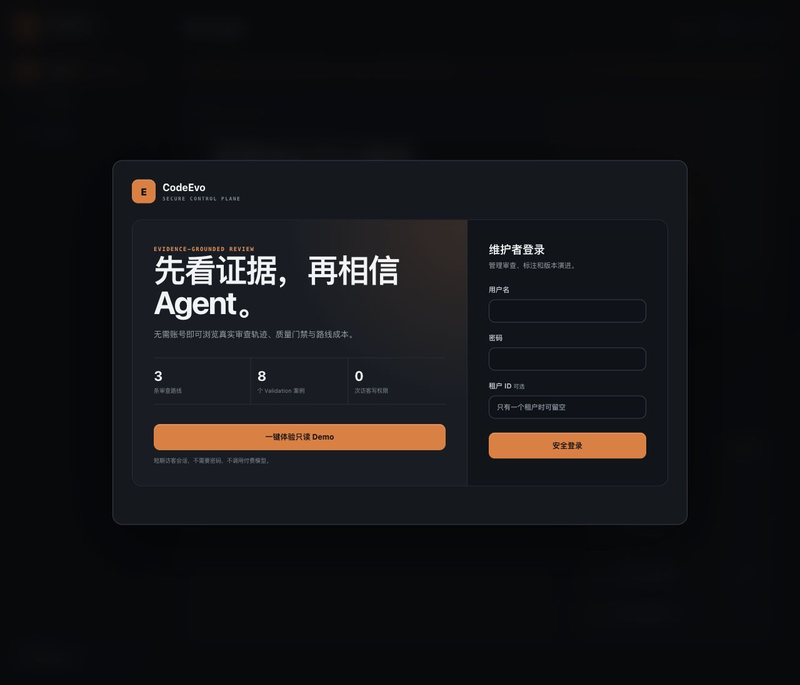
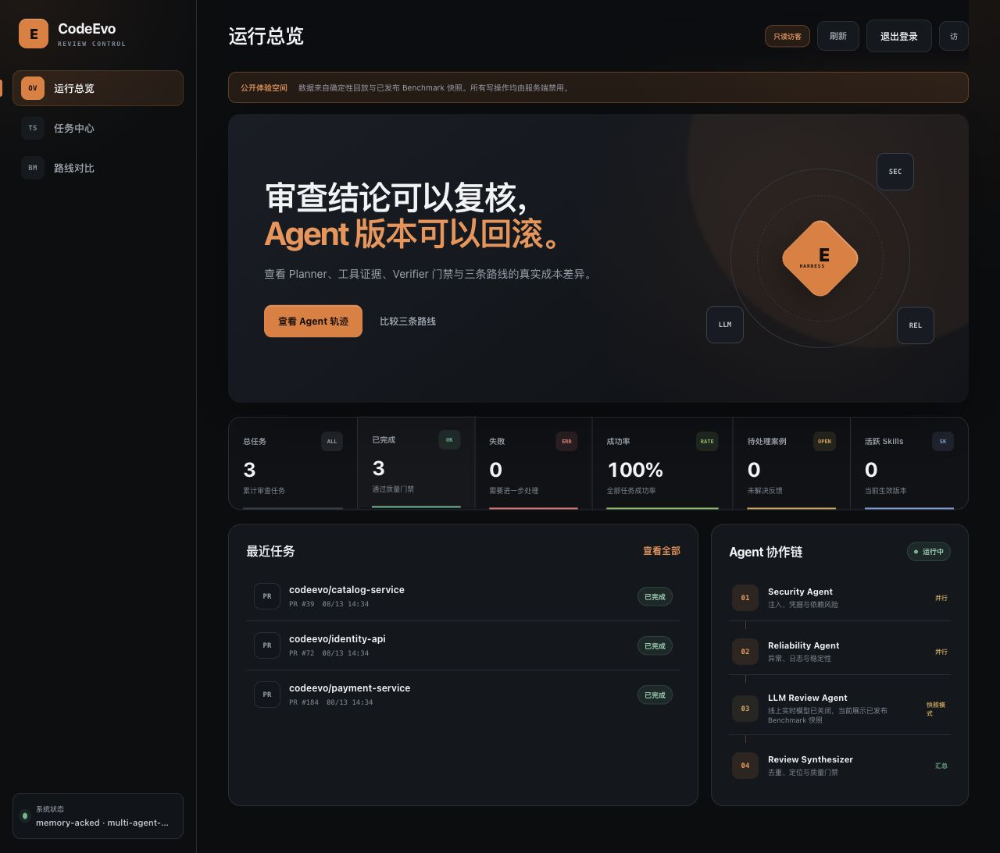
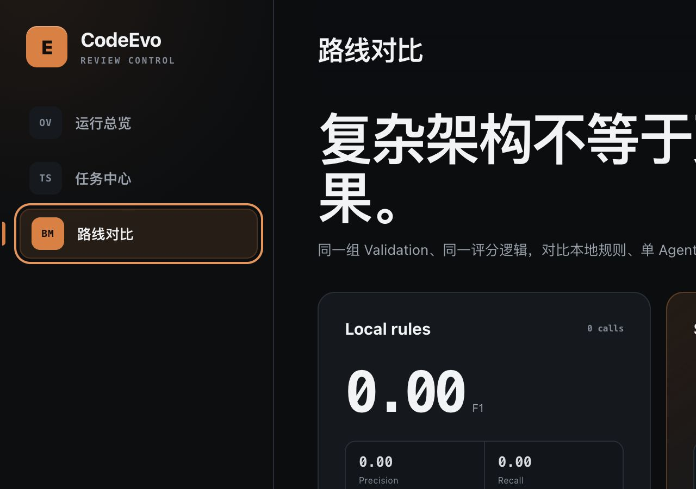
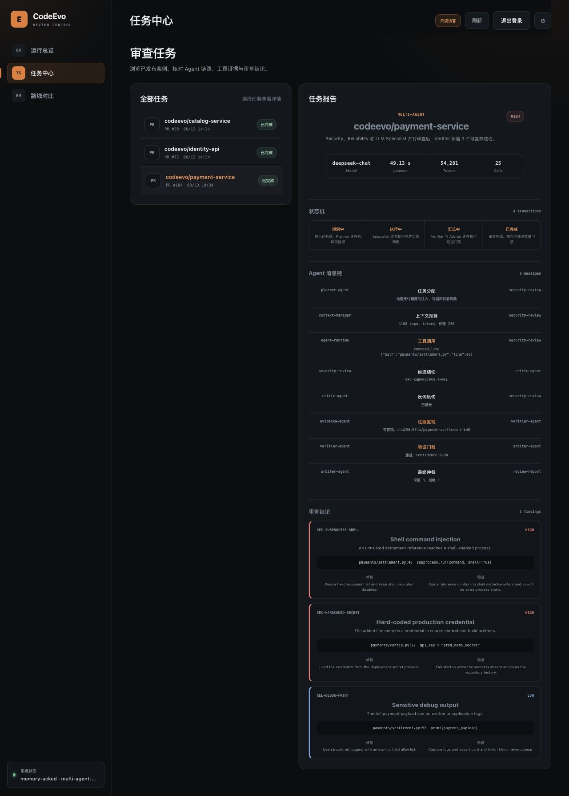
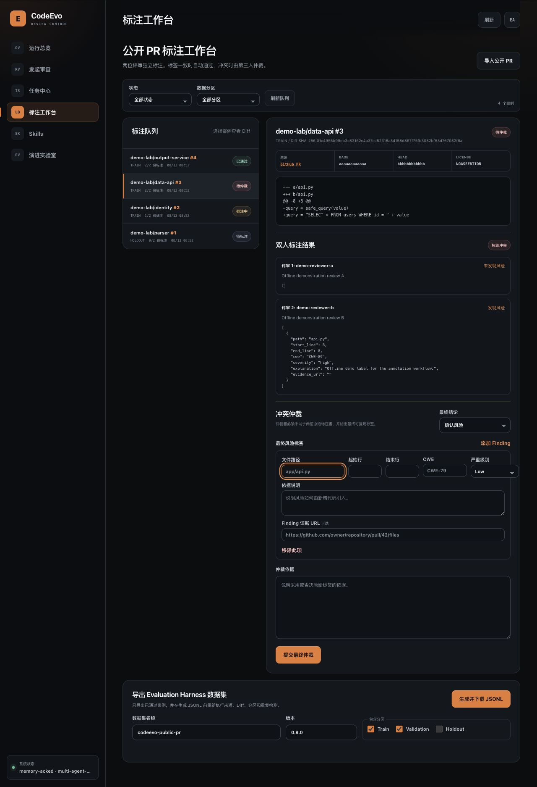

# CodeEvo 产品界面

[一键打开只读 Demo](https://vm-0-13-ubuntu.taila0420b.ts.net:8443) ·
[查看服务状态](https://vm-0-13-ubuntu.taila0420b.ts.net:8443/health/ready)

v1.0.0 的公开界面面向 AI Agent 招聘方设计：无需凭据，先比较真实路线指标，再下钻到状态机、Agent
消息、工具调用、证据和 Finding。访客不能创建或修改任何数据。

## 一键体验首屏



左侧先解释项目的核心判断：“先看证据，再相信 Agent”，右侧保留维护者登录。一键体验签发短期只读会话，
不触发模型调用。

## 运行总览



访客导航只包含运行总览、任务中心和路线对比。页面明确标记快照模式，避免把已发布 DeepSeek 结果误解为
实时在线模型。

## 路线对比



同一 Validation、同一评分逻辑比较 Local rules、Single DeepSeek 和 Multi-agent。展示 Precision、Recall、
F1、Clean Accuracy、P95、Tokens 和 Model calls，并坦诚呈现复杂架构不一定取得更高 F1。

## Agent 任务详情



任务报告按证据链组织：Route/Risk、模型成本、状态机、Agent 消息、Tool、Evidence、Verifier、Arbiter、
Finding、修复建议和验证建议。展示的是后端返回的真实预置数据，不是静态页面 Mock。

## 管理员标注工作台



管理员能力仍覆盖双人盲审、冲突仲裁和 Evaluation Harness 导出，但不会向 Guest 暴露。

## 本地复现

公开体验模式需要认证和隔离配置：

```bash
CODEEVO_AUTH_REQUIRED=true \
CODEEVO_AUTH_SECRET='<至少 32 字节随机值>' \
CODEEVO_BOOTSTRAP_ADMIN_USERNAME=admin \
CODEEVO_BOOTSTRAP_ADMIN_PASSWORD='<强密码>' \
CODEEVO_GUEST_DEMO_ENABLED=true \
python -m codeevo
```

浏览器打开 `http://127.0.0.1:8080`，点击“一键体验只读 Demo”。
