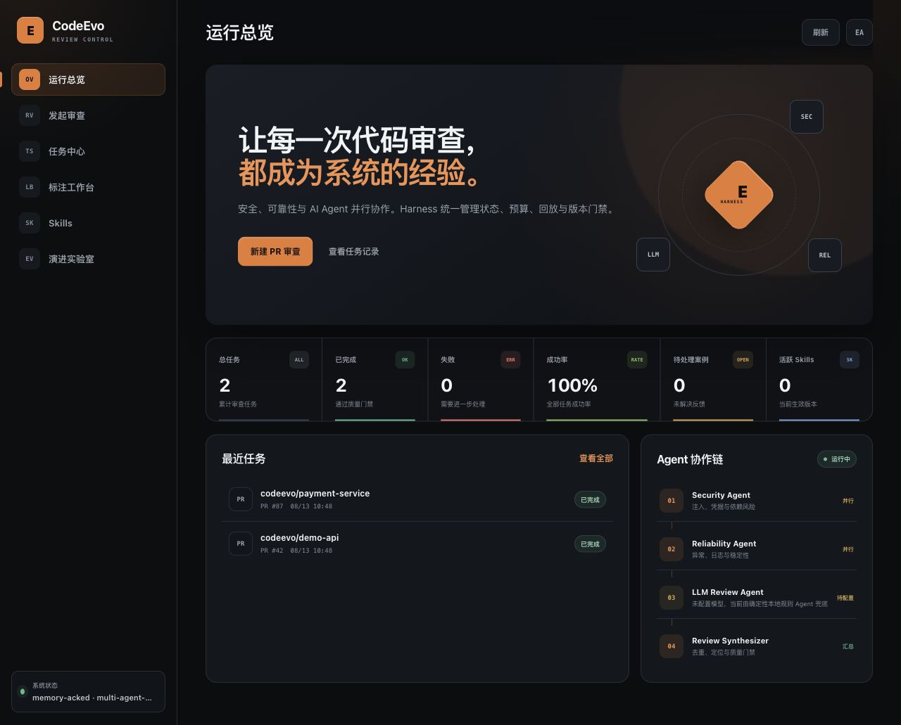

# CodeEvo 产品界面

以下截图来自本地真实服务和离线演示数据，不是设计稿或静态 Mock。

[打开公开 Demo](https://vm-0-13-ubuntu.taila0420b.ts.net:8443) ·
[查看服务状态](https://vm-0-13-ubuntu.taila0420b.ts.net:8443/health/ready)

公开实例启用了登录保护，默认运行本地确定性 Agent；体验凭据由项目维护者按需提供。

## 运行总览



运行总览集中展示审查任务、成功率、反馈、活跃 Skill，以及 Security、Reliability、LLM Review 与 Synthesizer 的协作链。截图中的两个任务均通过真实 `/v1/reviews` API 执行，其中风险任务检出动态执行、硬编码凭据、Shell 注入和调试输出。

## 标注工作台


标注工作台覆盖待标注、标注中、待仲裁和已通过四种状态。两个评审先盲审，冲突案例再由第三人仲裁；只有通过来源、位置、分区、重复和一致性门禁的案例可以导出到 Evaluation Harness。

## 快速复现

```bash
python scripts/run_local_demo.py --database output/codeevo-demo.db
```

浏览器打开 `http://127.0.0.1:8080`。离线演示明确标记为 Demo，不需要模型 Key，也不能作为公开 Benchmark 指标。
